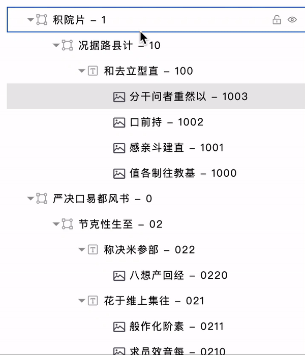

# Tree

[](https://github.com/ellerbrock/typescript-badges/) [](https://makeapullrequest.com) [](https://github.com/ellerbrock/open-source-badges/)

A React Tree Component

## How to use

In an ideal scenario, we only store the necessary data in the database. When retrieving data to construct a tree, we may need to extend some attributes in the tree nodes to align with our custom logic. So we need an API to tell the component which nodes can be inserted into other nodes.

1. Confirm whether the attributes are consistent. If they are not consistent, use `fieldNames` to set them.

```js
import { FigmaTree } from 'figma-tree'
import 'figma-tree/style.css'

export default App () => {
  const data= []
  const config = {}

  return (
    return (
    <FigmaTree
      {...config}
      data={data}
    />
  )
  )
}
```

## Feature

- [x] copy node
- [x] paste node
- [x] cut node
- [x] fold node
- [x] hidden node
- [x] lock node
- [x] move node
- [x] remove node
- [x] select single node
- [x] select multi nodes
- [x] context menu
- [x] change selected color
- [x] node icon
- [x] custom indent size

## Demo



## Node Proptery

If your tree structure matches the predefined fields, then you can use it directly.

```ts
interface TreeNode {
  id: string // Unique
  root: boolean
  name: string
  lock: boolean
  hidden: boolean
  fold: boolean
  selected: boolean
  edit: boolean
  slot?: boolean // Allow the insertion of additional tree nodes
  children?: TreeNode[] // If the node's slot property is true, the children property will be set
}
```

## API

| Property           | Description                                                                                                                                  | Type              | Default                                             | Version |
| ------------------ | -------------------------------------------------------------------------------------------------------------------------------------------- | ----------------- | --------------------------------------------------- | ------- |
| fieldNames         | Customize node title, key, children field name                                                                                               | object            | `{ name: 'name', key: 'id', children: 'children' }` |         |
| contextMenu        | Decide whether to allow right click show context menu                                                                                        | boolean           | false                                               |         |
| indentSize         | Set tree node indent, unit:px                                                                                                                | number            | 30                                                  |         |
| parentBgColor      | Parent node selected background color                                                                                                        | string            | #e9e9e9                                             |         |
| parentColor        | Parent node selected color                                                                                                                   | string            | #000                                                |         |
| childrenBgColor    | Children node selected background color                                                                                                      | string            | #f6f4f4                                             |         |
| childrenColor      | Children node selected color                                                                                                                 | string            | #000                                                |         |
| foldIconDisplay    | Decide how to display fold icon                                                                                                              | always,hover,none | always                                              |         |
<!-- | reverse            | Whether to rever each children                                                                                                               | boolean           | false                                               |         | -->
<!-- | sameLevelCopy      | Decide whether to allow copying at the same level, only effective when the `copy` API is enabled                                             | boolean           | false                                               |         | -->
<!-- | differentLevelCopy | Decide whether to allow copying across different levels, only effective when the `copy` API is enabled.                                      | boolean           | false                                               |         | -->
<!-- | defaultSelectMulti | Press Command ⌘ to select multiple tree node                                                                                                 | boolean           | false                                               |         | -->
<!-- | expandParent       | Whether to automatically expand all tree nodes **have children** by default                                                                  | boolean           | true                                                |         | -->
<!-- | expandAll          | Whether to automatically expand all tree nodes by default, **all nodes will display an arrow**. It has a higher priority than `expandParent` | boolean           | false                                               |         | -->

<!-- ## Methods

| Name             | Description                      | Params  | Value        | Version |
| ---------------- | -------------------------------- | ------- | ------------ | ------- |
| getData          | get tree data                    | -       | `TreeNode[]` |         |
| findNodeById     | get tree node data               | node id | `TreeNode`   |         |
| findNodeByAnchor | get tree node data               | node id | `TreeNode`   |         |
| extendProperty   | add custom property to tree node | node id | `TreeNode`   |         | -->
